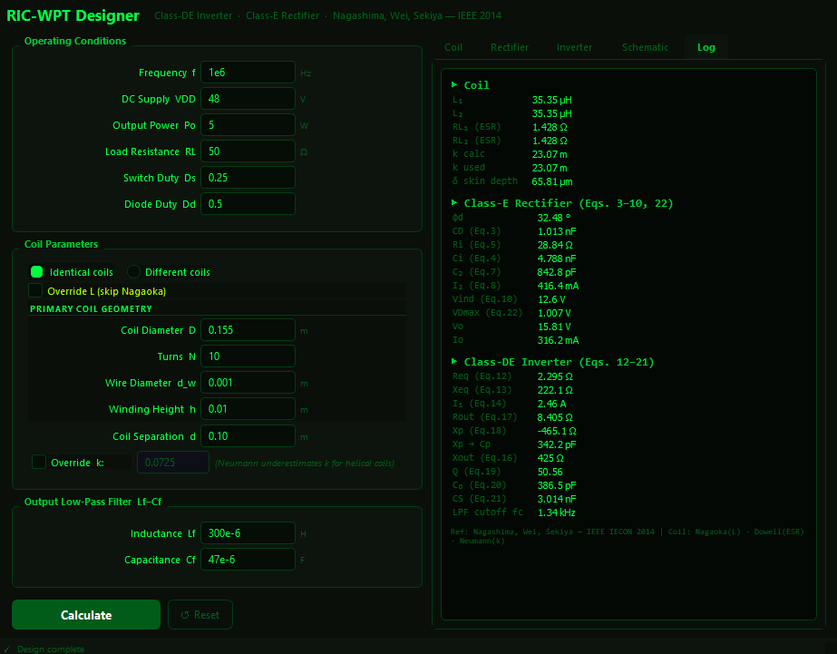
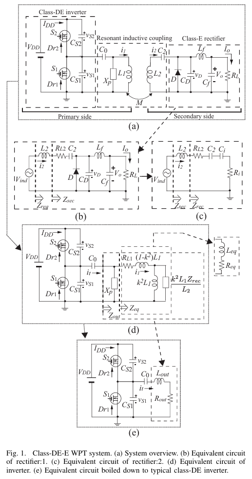
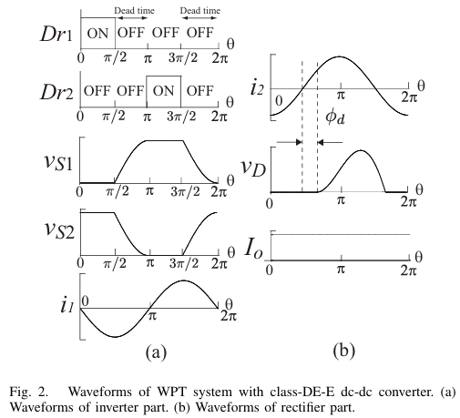

# RIC-WPT Designer

An analytical design tool for a **Resonant Inductively Coupled Wireless Power Transfer** system using a **Class-DE inverter** (transmitter) and **Class-E rectifier** (receiver). All component values are computed from closed-form equations — no simulation required.

Based on:
> T. Nagashima, X. Wei, H. Sekiya — *"Analytical Design Procedure for Resonant Inductively Coupled Wireless Power Transfer System With Class-DE Inverter and Class-E Rectifier"*, IEEE IECON 2014.

---

## Screenshot



---

## System Overview

### Circuit Schematic



The system comprises three sections connected in cascade:

- **Class-DE inverter** (primary side) — two complementary MOSFETs (S₁, S₂) with shunt capacitors C_S1, C_S2, a series resonant capacitor C₀, and an impedance transformation reactance X_p.
- **Resonant inductive coupling** — mutually coupled coils L₁ and L₂ (mutual inductance M = k√(L₁L₂)).
- **Class-E rectifier** (secondary side) — diode D, shunt capacitor C_D, and a low-pass filter L_f–C_f delivering DC to load R_L.

### Operating Waveforms



The inverter switches at 25 % duty ratio (D_s = 0.25). Dead time between switch transitions allows capacitive charge redistribution so that both v_S1 and v_S2 satisfy the class-E ZVS/ZDS conditions at their respective switching instants. The rectifier diode operates at duty ratio D_d and its voltage v_D likewise satisfies ZVS/ZDS at turn-off, enabling low-loss rectification at MHz frequencies.

---

## Features

- **Full analytical design** — solves all 22 paper equations in sequence; results appear instantly
- **Coil parameter calculation** — self-inductance via Nagaoka coefficient, AC ESR via Dowell's equation, coupling coefficient via Neumann's formula
- **Identical or independent coils** — toggle between a shared geometry for both coils or separate primary / secondary inputs
- **Direct L override** — bypass Nagaoka and enter L₁, L₂, RL₁, RL₂ directly (useful when you have measured or datasheet values)
- **k override** — enter a measured coupling coefficient to replace the Neumann analytical estimate (which underestimates k for helical coils)
- **LPF cutoff frequency** — displays `fc = 1 / (2π√(Lf·Cf))` alongside the filter components
- **Circuit schematic tab** — all 5 equivalent-circuit diagrams from the paper rendered as SVG with computed values annotated inline
- **CRT terminal theme** — phosphor-green on near-black

---

## Installation

**Requirements:** Python 3.8+

```bash
pip install PyQt5 scipy
```

Then run:

```bash
python main.py
```

---

## Project Structure

```
WPT_Designer/
├── main.py                   ← Entry point
├── requirements.txt
├── img/
│   ├── GUI_pic.png
│   ├── Schematic.png
│   └── Waveform.png
│
├── physics/                  ← Pure maths, no GUI dependency
│   ├── constants.py          ← MU0, RHO_COPPER
│   ├── coil_model.py         ← CoilModel  (Nagaoka · Dowell · Neumann)
│   └── wpt_design.py         ← WPTDesigner (all paper equations)
│
└── gui/                      ← PyQt5 presentation layer
    ├── style.py              ← Colour palette + Qt stylesheet
    ├── widgets.py            ← InputRow, OutputRow, eng() SI formatter
    ├── worker.py             ← DesignWorker QThread
    ├── schematic.py          ← SVG circuit diagram renderer
    └── main_window.py        ← MainWindow with all tabs and slots
```

The `physics/` layer has **zero GUI imports** — you can use `CoilModel` and `WPTDesigner` headlessly in your own scripts.

---

## How to Use

### 1 — Operating Conditions
Enter your target system specifications in the top-left panel.

| Field | Description | Paper value |
|---|---|---|
| Frequency f | Operating frequency | 1 MHz |
| DC Supply VDD | Input DC voltage | 48 V |
| Output Power Po | Desired output power | 5 W |
| Load Resistance RL | Load at output | 50 Ω |
| Switch Duty Ds | Class-DE switch on-duty ratio | 0.25 |
| Diode Duty Dd | Class-E diode on-duty ratio | 0.5 |

### 2 — Coil Parameters

**Identical coils** (default) — one set of geometry fields applies to both primary and secondary.  
**Different coils** — separate geometry fields appear for each side.

| Field | Description | Paper value |
|---|---|---|
| Coil Diameter D | Centre-to-centre winding diameter | 155 mm |
| Turns N | Number of turns | 10 |
| Wire Diameter d_w | Bare wire diameter | 1 mm |
| Winding Height h | Axial length of winding | 10 mm |
| Coil Separation d | Centre-to-centre coil distance | 100 mm |

**Override L** — tick this to skip Nagaoka/Dowell and enter L and ESR directly.  
**Override k** — tick this to enter a measured coupling coefficient. The Neumann formula is shown for reference but typically underestimates k for real helical coils by a factor of ~3×.

### 3 — Output Filter
Standard Lf–Cf low-pass filter values. The cutoff frequency `fc` is displayed in the results.

### 4 — Calculate
Press **Calculate**. Results populate across four tabs on the right.

---

## Output Tabs

### Coil
Computed coil parameters — self-inductance, AC ESR, analytical k, k used in design, and skin depth at the operating frequency.

### Rectifier
All Class-E rectifier components from the paper:

| Output | Equation | Description |
|---|---|---|
| φd | Eq. 6 | Phase shift between input current and switch voltage |
| C_D | Eq. 3 | Shunt capacitance across the diode |
| Ri | Eq. 5 | Effective input resistance |
| Ci | Eq. 4 | Effective input capacitance |
| C₂ | Eq. 7 | Series resonant capacitor on the secondary |
| I₂ | Eq. 8 | Secondary RMS current |
| Vind | Eq. 10 | Induced voltage at resonance |
| VDmax | Eq. 22 | Maximum voltage across the diode |

### Inverter
All Class-DE inverter components:

| Output | Equation | Description |
|---|---|---|
| Req | Eq. 12 | Reflected resistance into primary |
| Xeq | Eq. 13 | Reflected reactance into primary |
| I₁ | Eq. 14 | Primary (TX coil) RMS current |
| Rout | Eq. 17 | Optimal load resistance |
| Xp / Cp | Eq. 18 | Impedance transform reactance / equivalent capacitor |
| Xout | Eq. 16 | Output reactance |
| Q | Eq. 19 | Loaded quality factor |
| C₀ | Eq. 20 | Primary series resonant capacitor |
| CS1 = CS2 | Eq. 21 | Switch shunt capacitors |
| fc | — | LPF cutoff frequency `1/(2π√(Lf·Cf))` |

### Schematic
Live SVG rendering of the five equivalent-circuit diagrams (a)–(e) from the paper, with all computed component values annotated directly on the schematic. Updates automatically after each calculation.

---

## Mathematics

The design procedure is split into three stages: **coil modelling** (references [11] and [12] from the paper), **rectifier design** (Eqs. 3–10), and **inverter design** (Eqs. 12–22). All symbols match the paper exactly.

### Stage 1 — Coil Model

#### 1.1 Self-Inductance via Nagaoka Coefficient [Ref. 11]

The self-inductance of a single-layer solenoid is:

```
L = μ₀ · N² · π · r² / h · K_L
```

where `r = D/2` is the coil radius and `h` is the winding height. `K_L` is the **Nagaoka correction coefficient**, which accounts for the finite length of the solenoid relative to an ideal infinite solenoid. It is computed from complete elliptic integrals of the first and second kind, K(k) and E(k):

```
k_n = 1 / √(1 + (h / 2r)²)

K_L = (4 / 3π) · (1 / √(1 − k_n²)) · [
        ((1 − k_n²) / k_n²) · K(k_n)
      − ((1 − 2k_n²) / k_n²) · E(k_n)
      − k_n
      ]
```

As `h/r → 0` (flat coil) K_L → 0; as `h/r → ∞` (long solenoid) K_L → 1, recovering the ideal formula.

#### 1.2 AC Winding Resistance via Dowell's Equation [Ref. 12]

At high frequencies the skin effect increases winding resistance above the DC value. The DC resistance for a single-layer coil of N turns wound from wire of diameter `d_w` over a coil of radius `r` is:

```
R_dc = ρ · (N · 2π · r) / (π · (d_w/2)²)
```

The skin depth at frequency f is:

```
δ = √(ρ / (π · f · μ₀))
```

Dowell's equation converts the round wire to an equivalent foil of thickness `h_eq = d_w · √π / 2` and computes the AC-to-DC resistance ratio. For a single layer (no proximity effect from adjacent layers):

```
Δ = h_eq / δ

F_R = Δ · (sinh 2Δ + sin 2Δ) / (cosh 2Δ − cos 2Δ)

R_ac = R_dc · F_R
```

At low frequency (Δ → 0), F_R → 1 and R_ac = R_dc.

#### 1.3 Mutual Inductance and Coupling Coefficient via Neumann's Formula [Ref. 12]

For two identical coaxial N-turn coils of radius `a` separated by axial distance `d`, the mutual inductance is computed from the Neumann elliptic-integral formula applied to thin rings:

```
m² = 4a² / (4a² + d²)

M_single = (μ₀ · a / π) · [(2/m − m) · K(m) − (2/m) · E(m)]

M = N² · M_single
```

The coupling coefficient follows directly:

```
k = M / L
```

> **Important:** The thin-ring approximation underestimates k for real helical coils (the paper reports a factor of ~3× for the design example). Use the **Override k** field in the GUI when a measured value is available.

---

### Stage 2 — Rectifier Design (Class-E)

All equations below refer to the paper. `ω = 2πf`.

**Phase shift φ_d** (Eq. 6) between the secondary current `i₂` and the diode voltage:

```
tan φ_d = (1 − cos 2πD_d) / (2π(1 − D_d) + sin 2πD_d)
```

**Shunt capacitor C_D** (Eq. 3):

```
C_D = 1/(2πωR_L) · {
    (1 − cos 2πD_d)
  − 2π²(1 − D_d)²
  + [2π(1 − D_d) + sin 2πD_d]² / (1 − cos 2πD_d)
}
```

**Rectifier input resistance R_i** (Eq. 5):

```
R_i = 2 · R_L · sin²φ_d
```

**Rectifier input capacitance C_i** (Eq. 4):

```
C_i = π·C_D / [
    π(1 − D_d)
  + sin 2πD_d
  − (1/4)·sin 4πD_d · cos 2φ_d
  − (1/2)·sin 2φ_d · sin²2πD_d
  − 2π(1 − D_d) · sin φ_d · sin(2πD_d − φ_d)
]
```

**Series resonant capacitor C₂** (Eq. 7) — resonates L₂ against C_i:

```
C₂ = C_i / (ω²L₂C_i − 1)
```

If C₂ < 0, the secondary resonant element is inductive; the tool reports an equivalent series inductance `L_series = 1 / (ω²|C₂|)`.

**Secondary RMS current I₂** (Eq. 8):

```
I₂ = I_o / (√2 · sin φ_d)
```

**Induced voltage at resonance V_ind** (Eq. 10) — the imaginary part of Z_sec cancels at resonance, leaving:

```
V_ind = I₂ · (R_L2 + R_i)
```

**Maximum diode voltage V_Dmax** (Eq. 22):

```
φ_r = arctan(1 / (ωC_D R_L))

V_Dmax = (V_o / (ωC_D R_L)) · (2φ_r − π + 2/tan φ_r)
```

---

### Stage 3 — Inverter Design (Class-DE)

The rectifier is reflected through the transformer model into the primary side.

**Reflected resistance R_eq** (Eq. 12):

```
R_eq = R_L1 + k²ω²L₁L₂(R_L2 + R_i) / [(R_L2 + R_i)² + X_sec²]
```

**Reflected reactance X_eq** (Eq. 13):

```
X_eq = k²ωL₁ · [(R_L2 + R_i)² − L₂(C₂+C_i)/(C₂C_i) + (C₂+C_i)²/(ω²C₂²C_i²)]
       / [(R_L2 + R_i)² + X_sec²]
     + ωL₁(1 − k²)

where  X_sec = ωL₂ − (C₂+C_i)/(ωC₂C_i)
```

**Primary RMS current I₁** (Eq. 14):

```
I₁ = V_ind / (ω · k · √(L₁L₂))
```

**Optimal load resistance R_out** (Eq. 17) — from the class-DE condition at D_s = 0.25:

```
R_out = V_DD² / (2π² · R_eq · I₁²)
```

**Impedance transformation reactance X_p** (Eq. 18) — obtained by solving the quadratic derived from Eq. 15:

```
(R_eq − R_out)·X_p² − 2·R_out·X_eq·X_p − R_out·(X_eq² + R_eq²) = 0
```

The root with the larger magnitude is taken (paper convention). When X_p < 0 the element is capacitive: `C_p = −1/(ωX_p)`.

**Output reactance X_out** (Eq. 16):

```
X_out = [R_eq²·X_p + X_p·X_eq·(X_eq + X_p)] / [R_eq² + (X_eq + X_p)²]
```

**Loaded quality factor Q** (Eq. 19):

```
Q = X_out / R_out
```

**Series resonant capacitor C₀** (Eq. 20) — satisfies class-E ZVS/ZDS in the inverter:

```
C₀ = 1 / [ω · R_out · (Q − π/2)]
```

**Switch shunt capacitors C_S1 = C_S2** (Eq. 21):

```
C_S1 = C_S2 = 1 / (2π · ω · R_out)
```

---

## Coil Model Notes

| Quantity | Method | Notes |
|---|---|---|
| Self-inductance L | Nagaoka coefficient [11] | Accurate for single-layer solenoids; uses complete elliptic integrals |
| AC winding ESR | Dowell's equation [12] | Single-layer approximation; accounts for skin effect via equivalent foil thickness |
| Coupling coefficient k | Neumann's formula [12] | Thin-ring approximation — underestimates k for helical coils. Use override for measured values |

The paper's design example (coil diameter 155 mm, 10 turns, 1 mm wire, 10 mm height, 100 mm separation at 1 MHz) produces:

```
L₁ = L₂ = 35.35 µH     (paper: 35.4 µH)
RL₁ = RL₂ = 1.43 Ω     (paper: 1.36 Ω)
k (Neumann) = 0.023     (paper: 0.0725 — use override)
```

With k overridden to 0.0725 all Table I values reproduce to within 1–2%.

---

## Design Equations Reference

| Eq. | Quantity | Formula summary |
|---|---|---|
| 3 | CD | Shunt cap from Dd and RL |
| 4 | Ci | Rectifier input capacitance |
| 5 | Ri | `2·RL·sin²φd` |
| 6 | φd | `atan((1−cos2πDd) / (2π(1−Dd)+sin2πDd))` |
| 7 | C2 | Resonates L2 with Ci |
| 8 | I2 | `Io / (√2·sinφd)` |
| 10 | Vind | `I2·(RL2+Ri)` at resonance |
| 12 | Req | Primary reflected resistance |
| 13 | Xeq | Primary reflected reactance |
| 14 | I1 | `Vind / (ω·k·√(L1·L2))` |
| 17 | Rout | `VDD² / (2π²·Req·I1²)` |
| 18 | Xp | Quadratic solve from Eq. 15 |
| 16 | Xout | Output reactance via Xp, Xeq, Req |
| 19 | Q | `Xout / Rout` |
| 20 | C0 | `1 / (ω·Rout·(Q−π/2))` |
| 21 | CS1=CS2 | `1 / (2π·ω·Rout)` |
| 22 | VDmax | Maximum diode voltage |

---

## Reference

T. Nagashima, X. Wei, H. Sekiya,
*"Analytical Design Procedure for Resonant Inductively Coupled Wireless Power Transfer System With Class-DE Inverter and Class-E Rectifier"*,
Proceedings of the IEEE IECON 2014, pp. 611–616.

[11] H. Nagaoka, "The inductance coefficients of solenoids," *J. Coll. Sci., Imp. Univ. Tokyo*, vol. 27, pp. 18–33, 1909.

[12] M. K. Kazimierczuk, *High-Frequency Magnetic Components*, New York, NY: John Wiley & Sons, 2009.